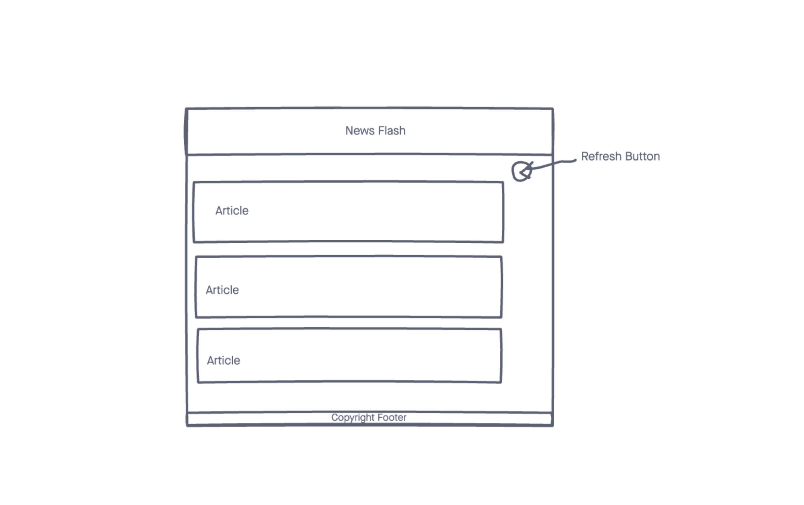

# News-Flash

A minimalisticly themed display for recent updates from the NY Times.

## ⚙️ Technologies Used
- HTML5
- CSS3
- JS
- jQuery
- [New York Times API](https://developer.nytimes.com/)
- Github Pages (for deployment)

## 📸 Screenshots

## 🎬 Getting Started
[Click](https://news-flash.vercel.app/) here to see the live app! 

## 🛠 Future Enhancements
- Looking to add a search bar that will search the NY Times archive up until the prior 30 days.
- Want to add a small weather widget in the top right corner.
- Would like to add a modal and have the articles take up less space on the page overall & enable viewers to see each abstract one at a time.
- Upload multiple API sources and a search bar to search all databases.